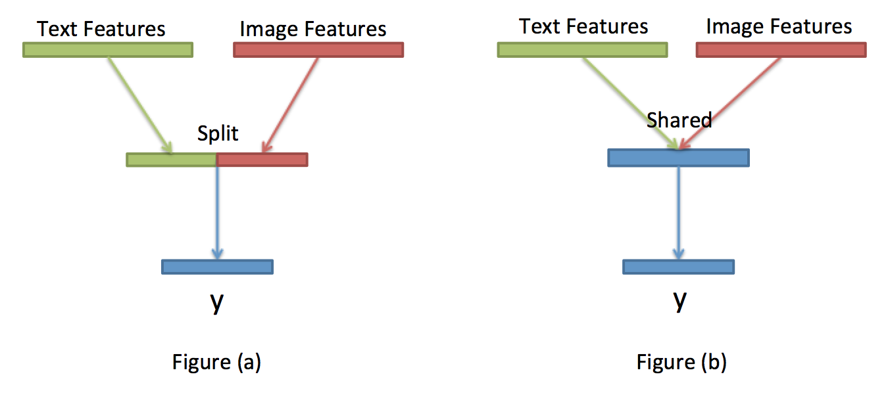

<!-- # transfer_learning

## TODO

## Prepare dataset in the format
`X = [[t1, i1], [t2, i2], ...]` where t1 is the text feature corresponding to image i1 and
`y = [y1, y2, ...]` is the label. -->

# Transfer Learning
This package demonstrates how to build a transfer learning network effortlessly with [Mozi](https://github.com/hycis/Mozi).

<!--  -->

Standard `transfer learning` also known as `multi-task learning` or `multi-modal learning` consist of multiple different feature spaces, for example, a text feature space and an image feature space, merging together into a shared representation. For example in the figure above, we try map both the image and text to a common shared feature space.
