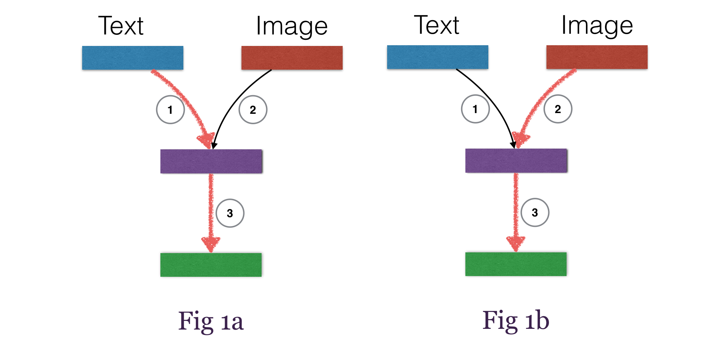
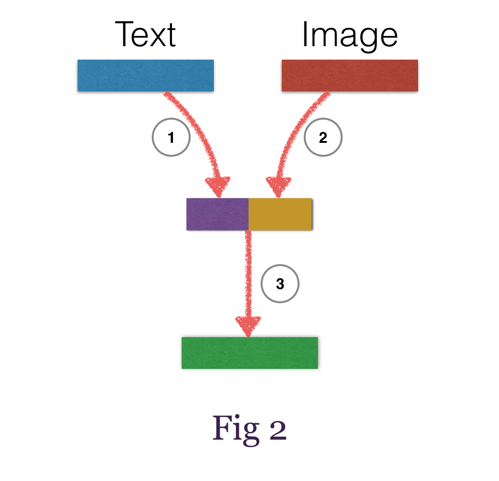

<!-- # transfer_learning

## TODO

## Prepare dataset in the format
`X = [[t1, i1], [t2, i2], ...]` where t1 is the text feature corresponding to image i1 and
`y = [y1, y2, ...]` is the label. -->

# Transfer Learning with Theano
This package demonstrates how to build a transfer learning network effortlessly with [Theano](https://github.com/Theano/Theano.git) and [Mozi](https://github.com/hycis/Mozi).

<!--  -->

Standard `transfer learning` also known as `multi-task learning` or `multi-modal learning` typically has multiple inputs and multiple outputs. And generally there are two types, `Type 1` (Fig 1) has a common shared representation layer where the objective is to map different modalities into a common representation space, while `Type 2` (Fig 2) tries to keep individual modality representation space separate, and finally concatenate them to pass through subsequent layers for fine-tuning.

The way to train `Type1` and `Type2` is also different. For `Type 1`, you first train `1 -> 3` (Fig 1a) then `2 -> 3` (Fig 1b), while for `Type 2`, you concatenate the outputs from `step 1` and `step 2` (Fig 2) before proceeding to `step 3` with the concatenated features, i.e  `1 + 2 -> 3`.

Checkout [Type 1 Model](type1_train.py) and [Type 2 Model](type2_train.py)
