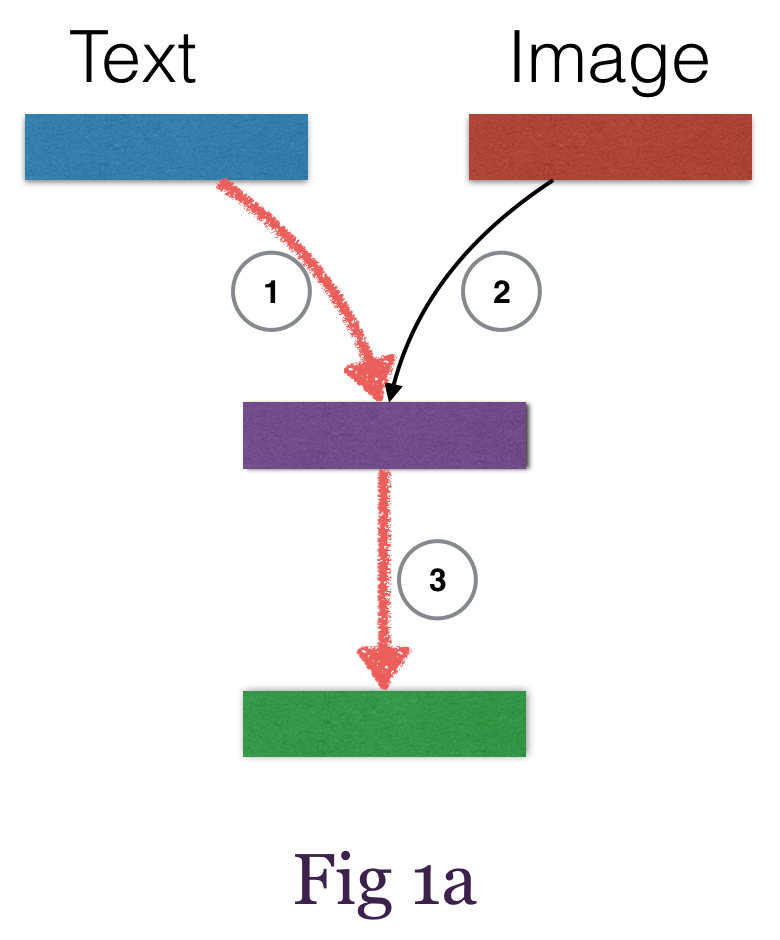
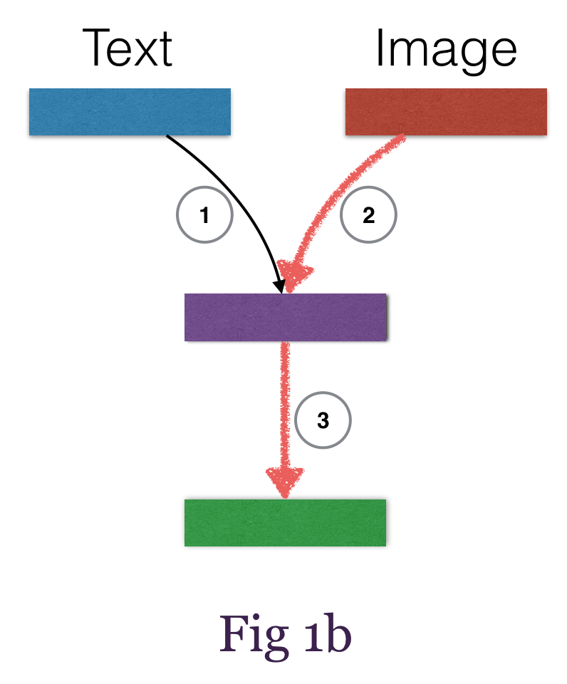

<!-- # transfer_learning

## TODO

## Prepare dataset in the format
`X = [[t1, i1], [t2, i2], ...]` where t1 is the text feature corresponding to image i1 and
`y = [y1, y2, ...]` is the label. -->

# Transfer Learning with Theano
This package demonstrates how to build a transfer learning network effortlessly with [Theano](https://github.com/Theano/Theano.git) and [Mozi](https://github.com/hycis/Mozi).

<!--  -->




Standard `transfer learning` also known as `multi-task learning` or `multi-modal learning` typically has multiple inputs and multiple outputs. And generally there are two types, `Type 1` (Fig 1) has a common shared representation layer where the objective is to map different modalities into a common representation space, while `Type 2` (Fig 2) tries to keep individual modality representation space separate, and finally concatenate them to pass through subsequent layers for fine-tuning.

The way to train `Type1` and `Type2` is also different. For `Type 1`, you first train `1 -> 3` (Fig 1a) then `2 -> 3` (Fig 1b), while for `Type 2`, you concatenate the outputs from `step 1` and `step 2` (Fig 2) before proceeding to `step 3` with the concatenated features, i.e  `1 + 2 -> 3`.


```python
_TEXT_INPUT_DIM_ = 10
_NUM_EXP_ = 1000
_IMG_INPUT_DIM_ = (3, 32, 32)
_OUTPUT_DIM_ = 100
_TEXT_OUTPUT_DIM_ = 100
_IMG_OUTPUT_DIM_ = 80

# build dataset
txt = np.random.rand(_NUM_EXP_, _TEXT_INPUT_DIM_)
img = np.random.rand(_NUM_EXP_, *_IMG_INPUT_DIM_)
y = np.random.rand(_NUM_EXP_, _OUTPUT_DIM_)
data = MultiInputsData(datasets=(txt, img), labels=(y,))

# build left and right model
left_model = _left_model(_TEXT_INPUT_DIM_, _TEXT_OUTPUT_DIM_)
right_model = _right_model(_IMG_INPUT_DIM_, _IMG_OUTPUT_DIM_)

# build the master model
model = Sequential(input_var=(T.matrix(), T.tensor4()), output_var=T.matrix())
model.add(Parallel(left_model, right_model))
model.add(FlattenAll())
model.add(Concate(_TEXT_OUTPUT_DIM_ + _IMG_OUTPUT_DIM_, _OUTPUT_DIM_))

# build learning method
learning_method = SGD(learning_rate=0.01, momentum=0.9,
                      lr_decay_factor=0.9, decay_batch=5000)

# put everything into the train object
train_object = TrainObject(model = model,
                           log = None,
                           dataset = data,
                           train_cost = entropy,
                           valid_cost = error,
                           learning_method = learning_method,
                           stop_criteria = {'max_epoch' : 10,
                                            'epoch_look_back' : 5,
                                            'percent_decrease' : 0.01}
                           )
# finally run the code
train_object.setup()
train_object.run()
```
